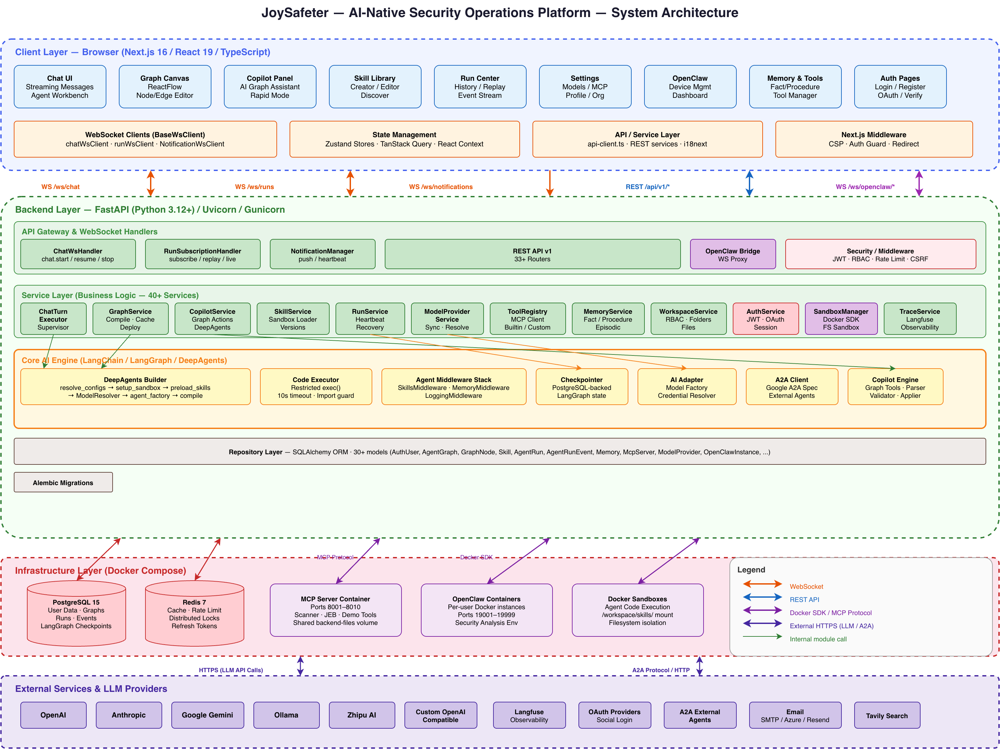
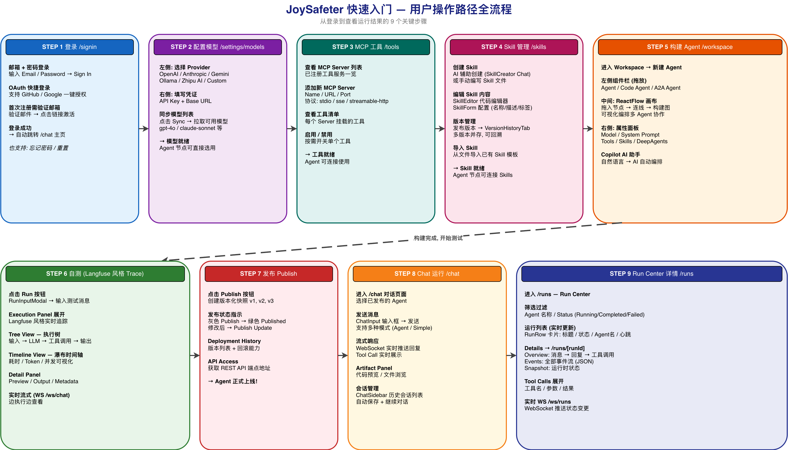

<h1 align="center">
  <br/>
  JoySafeter
</h1>

<p align="center">
  <strong>AI 原生安全智能体平台 —— 构建、编排、规模化运行安全 Agent。</strong><br/>
  <sub>从想法到生产级安全自动化，只需几分钟，而非数月。</sub>
</p>

<p align="center">
  <a href="https://www.apache.org/licenses/LICENSE-2.0"></a>
  <a href="https://www.python.org/downloads/"></a>
  <a href="https://nodejs.org/"></a>
  <a href="https://github.com/langchain-ai/langgraph"></a>
  <a href="https://fastapi.tiangolo.com/"></a>
  <a href="#"></a>
  <a href="#"></a>
</p>

<p align="center">
  <a href="./README.md">English</a> | 简体中文
</p>

---

## 为什么选择 JoySafeter

传统安全工具有天花板：脚本脆弱易断、单 Agent 缺乏上下文、复杂场景需要 2–3 名工程师并行协作。JoySafeter 打破这个天花板。

| 挑战 | 传统方式 | JoySafeter |
|------|---------|------------|
| APK 漏洞分析 | 手动 MobSF + 工程师人工审查 | 自主 Agent：上传 → 分析 → 出报告 |
| 渗透测试 | 固定脚本、静态 Playbook | DeepAgents 根据发现实时动态决策 |
| 工具集成 | 每个工具单独写胶水代码 | 200+ 工具通过 MCP 协议零胶水接入 |
| 规模扩展 | 人力线性增长 | Agent 团队倍增安全产能 |

> JoySafeter 定义了全新范式：**AI 驱动安全运营（AISecOps）** —— 用多智能体协作、认知记忆进化、场景化战力速配，取代人工协调，实现安全能力的规模化运营。

---

## 实战案例

### 案例一 —— APK 漏洞检测智能体

> 上传 APK，获得 OWASP Mobile Top 10 检测报告，全程无需人工干预。

<p align="center">
  
</p>

**运行流程：**

1. 用户上传 APK 文件
2. Agent 调用 MobSF 进行静态分析
3. 提取关键风险点 —— 权限滥用、硬编码密钥、不安全的网络配置等
4. 对高危项通过 Frida 动态插桩进行深度验证
5. 自动生成符合 OWASP Mobile Top 10 格式的结构化检测报告

整个流程从上传到出报告，零人工干预，覆盖了传统需要 2–3 名安全工程师协作完成的工作量。

---

### 案例二 —— 渗透测试智能体

> 给出目标和测试范围，Agent 自主规划、执行、动态调整，最终交付报告。

<p align="center">
  
</p>

**操作流程：**

1. 进入工作台，创建新 Agent
2. 开启 **DeepAgents 模式** → 选择渗透测试相关 Skills
3. 输入经过授权的目标地址和测试要求
4. Agent 自主运行 —— 若发现登录页面，自动触发认证绕过测试
5. 运行结束后下载完整报告

> **备注：** 需在沙箱设置中配置镜像 `swr.cn-north-4.myhuaweicloud.com/ddn-k8s/ghcr.io/jd-opensource/joysafeter-sandbox:latest`。

这种根据侦察结果动态决定下一步的能力，是传统固定脚本无法实现的。

---

## 核心能力

<table>
<tr>
<td width="50%">

### 可视化 Agent 构建器

- **无代码工作流编辑器** —— 拖拽节点，支持循环、条件、并行执行
- **快速模式** —— 用自然语言描述需求，分钟级生成可运行的 Agent 团队
- **深度模式** —— 可视化调试 + 逐步可观测，适用于复杂安全研究的持续迭代

</td>
<td width="50%">

### 200+ 安全工具开箱即用

- 预集成 **Nmap、Nuclei、Trivy** 等主流工具
- **MCP 协议** —— 通过模型上下文协议扩展任意工具
- **30+ 预置技能** —— 渗透测试、文档分析、云安全等

</td>
</tr>
<tr>
<td width="50%">

### DeepAgents 编排引擎

- **Manager-Worker 多层级**智能体协作
- **记忆进化** —— 长短期记忆机制，跨会话持续学习
- **技能体系** —— 版本化、可复用的能力单元，渐进式披露
- **LangGraph 引擎** —— 基于图的工作流与完整状态管理

</td>
<td width="50%">

### 企业级就绪

- **多租户** —— 基于角色的工作区隔离与访问控制
- **全链路审计** —— 执行追踪与合规治理
- **SSO 集成** —— GitHub、Google、Microsoft、OIDC（Keycloak、Authentik、GitLab）、JD SSO
- **多租户沙箱** —— 用户级代码执行隔离，会话间零状态泄露

</td>
</tr>
</table>

---

## 快速开始

### 一键启动（推荐）

```bash
./deploy/quick-start.sh
```

脚本提供交互式菜单，选择启动模式并自定义端口（自动检测冲突）：

| 模式 | 说明 | 配置的端口 |
|------|------|-----------|
| **(1) Docker Compose 全栈** | 所有服务容器化运行，支持本机或远程服务器 IP/域名 | 前端、后端、PostgreSQL、Redis |
| **(2) 仅本地前端** | `bun run dev`，支持连接远程后端 | 前端（可指定远程后端地址） |
| **(3) 仅本地后端** | `uvicorn --reload`，支持连接远程 DB/Redis | 后端（可指定远程 DB/Redis/前端地址） |
| **(4) 本地前端 + 后端** | 自动启动中间件，支持对外暴露非 localhost 地址 | 前端、后端 |

每种模式都支持远程部署场景：
- **Docker Compose 全栈** — 询问部署地址（localhost 或 IP/域名）+ http/https 协议
- **仅本地前端** — 可选连接远程后端 API（输入后端 IP + 端口 + 协议）
- **仅本地后端** — 可选连接远程 PostgreSQL、Redis、前端（分别输入地址和端口）
- **本地前端 + 后端** — 可选通过非 localhost 地址对外提供服务
- 非 localhost 部署时自动更新 `frontend/.env` 的 CSP 白名单（`NEXT_PUBLIC_CSP_CONNECT_SRC_EXTRA`）

```bash
./deploy/quick-start.sh --skip-env       # 跳过 .env 文件初始化
./deploy/quick-start.sh --skip-db-init   # 跳过数据库初始化
```

### 按场景启动

```bash
# ─── 开发场景 ───────────────────────────────────────────
./deploy/scripts/dev.sh                  # Docker 全栈开发（前后端容器化，适合联调）
./deploy/scripts/dev-local.sh            # 本地开发准备（启动中间件，后端/前端在本地跑）
./deploy/scripts/dev-backend.sh          # 仅启动本地后端（需中间件已启动）
./deploy/scripts/dev-frontend.sh         # 仅启动本地前端（需后端已启动）

# ─── 生产场景 ───────────────────────────────────────────
./deploy/scripts/prod.sh                 # 生产部署（预构建镜像 + docker-compose.prod.yml）
./deploy/scripts/prod.sh --skip-mcp      # 生产部署，不启动 MCP 服务
./deploy/scripts/prod.sh --skip-pull     # 跳过镜像拉取，使用本地已有镜像

# ─── 中间件 / 基础设施 ─────────────────────────────────
./deploy/scripts/start-middleware.sh     # 启动中间件（PostgreSQL + Redis + MCP）
./deploy/scripts/minimal.sh             # 最小化启动（仅 PostgreSQL + Redis）
./deploy/scripts/minimal.sh --with-mcp  # 最小化 + MCP 服务
./deploy/scripts/stop-middleware.sh      # 停止中间件

# ─── 测试 / CI ──────────────────────────────────────────
./deploy/scripts/test.sh                 # 测试环境（最小依赖，适合自动化）

# ─── 安装 / 检查 ────────────────────────────────────────
./deploy/install.sh                      # 交互式安装向导（生成配置文件）
./deploy/install.sh --mode dev --non-interactive  # 非交互式安装
./deploy/scripts/check-env.sh           # 环境预检（Docker、端口、配置文件）

# ─── 镜像管理 ───────────────────────────────────────────
./deploy/deploy.sh build                 # 构建前后端镜像
./deploy/deploy.sh build --all           # 构建所有镜像（含 OpenClaw）
./deploy/deploy.sh push                  # 构建并推送到仓库
./deploy/deploy.sh pull                  # 拉取最新预构建镜像
```

### 默认端口

| 服务 | 端口 | 说明 |
|------|------|------|
| 前端 | `3000` | http://localhost:3000 |
| 后端 API | `8000` | http://localhost:8000 |
| API 文档 | `8000/docs` | Swagger UI |
| PostgreSQL | `5432` | 数据库 |
| Redis | `6379` | 缓存 |

> **环境要求：** Docker + Docker Compose。详细安装指南请参考 [INSTALL_CN.md](INSTALL_CN.md)，生产部署请参考 [deploy/PRODUCTION_IP_GUIDE.md](deploy/PRODUCTION_IP_GUIDE.md)。

---

## 架构概览

<p align="center">
  
</p>

> 详细架构：[docs/ARCHITECTURE_CN.md](docs/ARCHITECTURE_CN.md)

**核心设计原则：**

- **图式执行** —— 每个 Agent 工作流都是有状态的 LangGraph，支持暂停、恢复与分支
- **白盒可观测性** —— 基于 Langfuse 实时追踪每一步 Agent 决策与状态流转
- **分层技能体系** —— 技能是版本化单元，可自由组合成工作流，互不耦合

### 用户操作路径 —— 9 步快速入门

<p align="center">
  
</p>

> **登录** → **配置模型** → **MCP 工具** → **Skill 管理** → **构建 Agent** → **自测 (Langfuse Trace)** → **发布** → **Chat 运行** → **Run Center**

---

## 技术栈

| 层级 | 技术 | 用途 |
|------|------|------|
| **前端** | Next.js 16, React 19, TypeScript | 服务端渲染，App Router |
| **UI** | Radix UI, Tailwind CSS, Framer Motion | 无障碍、动画组件 |
| **状态管理** | Zustand, TanStack Query | 客户端与服务端状态 |
| **工作流编辑器** | React Flow | 交互式节点编辑器 |
| **后端** | FastAPI, Python 3.12+ | 异步 API，OpenAPI 文档 |
| **AI 框架** | LangChain, LangGraph, DeepAgents | Agent 编排与工作流 |
| **MCP** | mcp 1.20+, fastmcp 2.14+ | 工具协议支持 |
| **数据库** | PostgreSQL, SQLAlchemy 2.0 | 异步 ORM，数据库迁移 |
| **缓存** | Redis | 会话缓存与限流 |
| **可观测性** | Langfuse, Loguru | 追踪与结构化日志 |

---

## 最新动态

> 完整更新记录：[CHANGELOG.md](CHANGELOG.md)

| 标签 | 功能 | 一句话说明 |
|------|------|-----------|
| **NEW** | **模型设置主从面板** | 全新设计的模型管理页面——供应商侧边栏 + 详情面板，表单由 Schema 驱动，一键创建自定义模型 |
| **NEW** | **模型用量统计** | 按模型维度的用量日志，StatsTab 可视化展示，SSE 测试流端点 |
| **NEW** | **自定义供应商 API** | 单个 `POST /model-providers/custom` 端点一次创建供应商 + 凭据 + 模型实例 |
| **NEW** | **技能版本化与协作** | 发布、回滚、管理技能版本；邀请协作者并按角色授权；平台 API Token 支持 CI/CD 集成 |
| **NEW** | **多租户沙箱引擎** | 用户级代码执行隔离——会话间零状态泄露 |
| **NEW** | **企业 SSO** | 内置 GitHub / Google / Microsoft 模板，支持 OIDC 与 JD SSO |
| **UPGRADE** | **DeepAgents v0.4** | 多智能体内核的最新稳定性与性能优化 |
| **UPGRADE** | **白盒可观测性** | 基于 Langfuse 实时追踪每一步 Agent 决策与状态流转 |

---

## 文档

### 快速上手
- [INSTALL_CN.md](INSTALL_CN.md) — 安装指南（Docker / 手动 / 预构建镜像）
- [DEVELOPMENT.md](DEVELOPMENT.md) — 本地开发
- [deploy/README.md](deploy/README.md) — Docker 部署
- [deploy/PRODUCTION_IP_GUIDE.md](deploy/PRODUCTION_IP_GUIDE.md) — 生产环境部署

### 深入了解
- [docs/ARCHITECTURE_CN.md](docs/ARCHITECTURE_CN.md) — 架构总览
- [backend/README.md](backend/README.md) — 后端指南
- [frontend/README.md](frontend/README.md) — 前端指南

### 教程
参见 [docs/tutorials/](docs/tutorials/)，包含模型配置、MCP 集成、技能开发等逐步指南。

### 项目治理
- [CONTRIBUTING.md](CONTRIBUTING.md) — 贡献指南
- [SECURITY.md](SECURITY.md) — 安全策略
- [CODE_OF_CONDUCT.md](CODE_OF_CONDUCT.md) — 行为准则

---

## 社区

如有问题或想与其他用户交流，欢迎扫码加入微信交流群：

<p align="center">
  
  &nbsp;&nbsp;&nbsp;&nbsp;
  
</p>

---

## 贡献指南

```bash
git clone https://github.com/jd-opensource/JoySafeter.git
git checkout -b feature/amazing-feature
git commit -m 'feat: add amazing feature'
git push origin feature/amazing-feature
```

详情请查看 [CONTRIBUTING.md](CONTRIBUTING.md)。

---

## 许可证

Apache License 2.0 —— 详见 [LICENSE](LICENSE) 文件。

第三方组件许可证：[THIRD_PARTY_LICENSES.md](THIRD_PARTY_LICENSES.md)

---

## 致谢

<table>
<tr>
<td align="center"><a href="https://github.com/langchain-ai/langchain"><br/><sub>LangChain</sub></a></td>
<td align="center"><a href="https://github.com/langchain-ai/langgraph"><br/><sub>LangGraph</sub></a></td>
<td align="center"><a href="https://fastapi.tiangolo.com/"><br/><sub>FastAPI</sub></a></td>
<td align="center"><a href="https://nextjs.org/"><br/><sub>Next.js</sub></a></td>
<td align="center"><a href="https://www.radix-ui.com/"><br/><sub>Radix UI</sub></a></td>
</tr>
</table>

---

<p align="center">
  <sub>由 JoySafeter 团队用 ❤️ 打造</sub><br/>
  <sub>如需咨询商业方案，请联系京东科技解决方案团队：<a href="mailto:org.ospo1@jd.com">org.ospo1@jd.com</a></sub>
</p>
