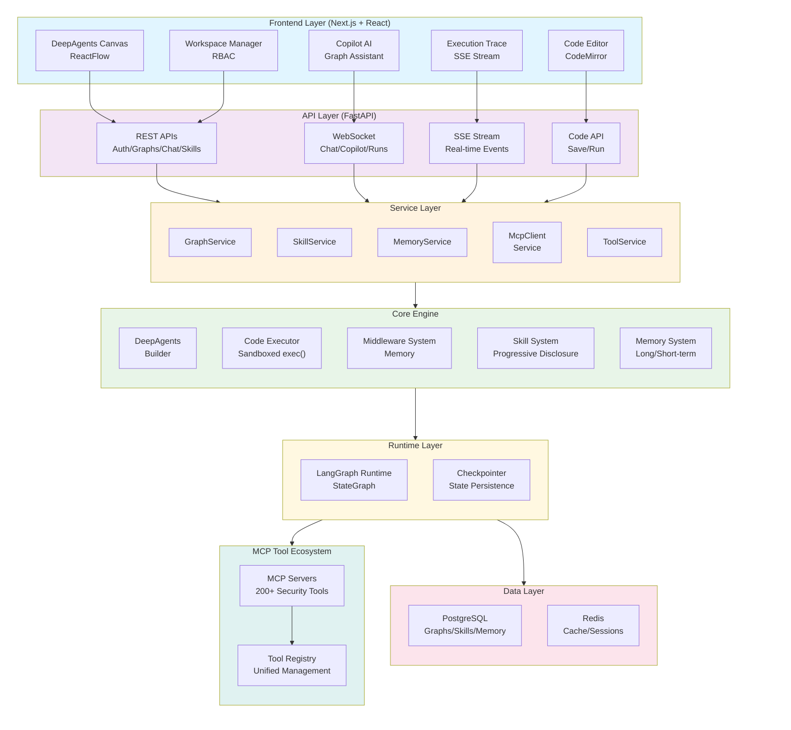
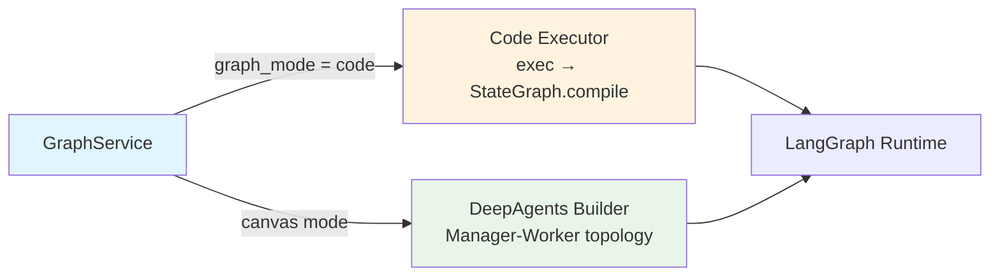
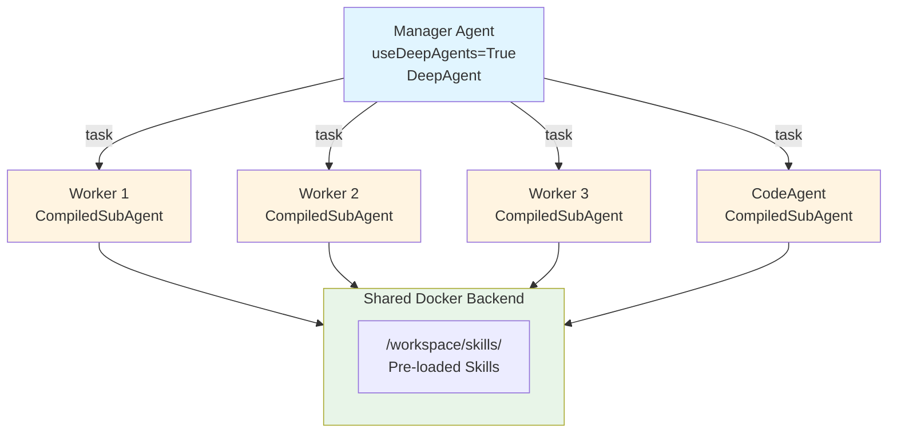
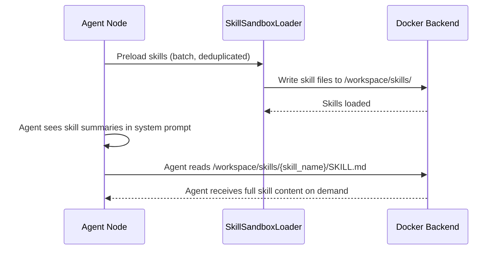
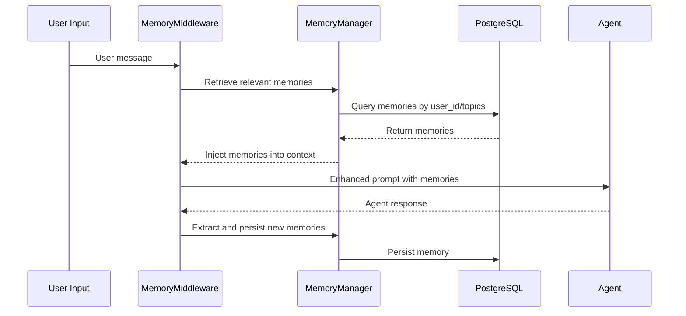
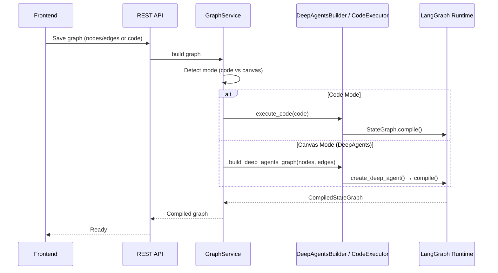
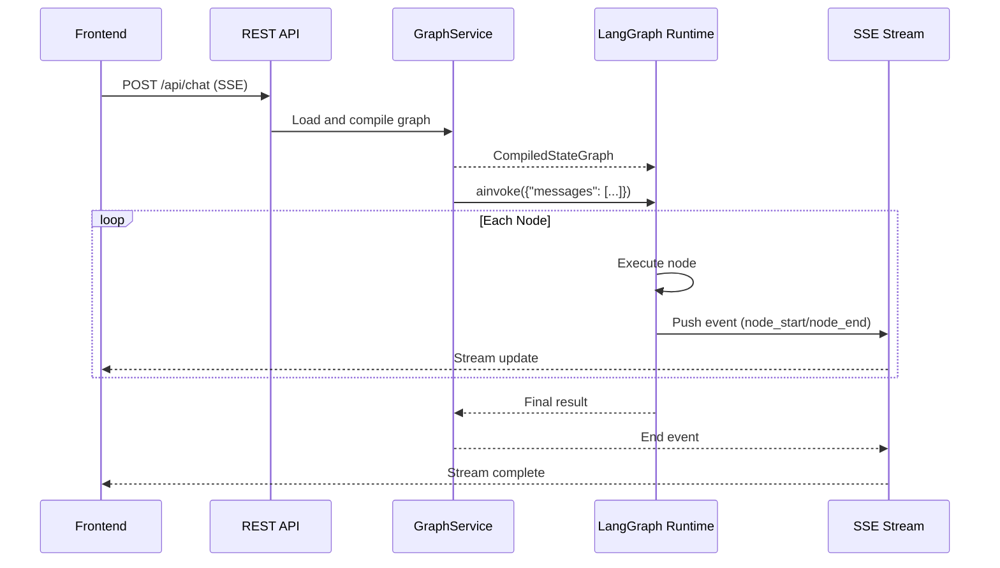

# Architecture

## Overall Architecture

JoySafeter follows a layered architecture pattern with clear separation of concerns:



### Core Modules

#### 1. Graph Build System — Two Paths

The system supports two graph building modes:



**Code Mode:**
- User writes standard LangGraph Python code in the browser editor
- Backend executes code in a sandboxed environment (restricted builtins, import whitelist, exec timeout)
- Extracts `StateGraph` instance from executed code, compiles and runs it
- Zero learning curve — LangGraph docs are the docs

**DeepAgents Canvas Mode:**
- Visual drag-and-drop builder for multi-agent orchestration
- Three node types: Agent, Code Agent, A2A Agent
- Builds Manager-Worker star topology via `deepagents.create_deep_agent()`

#### 2. DeepAgents Multi-Agent Orchestration

DeepAgents implements a star topology with one Manager coordinating multiple Workers:



**DeepAgents Build Pipeline:**

```
build_deep_agents_graph()
    ├── 1. resolve_all_configs()     — pure config extraction, no side effects
    ├── 2. setup shared backend      — Docker sandbox if needed
    ├── 3. preload_skills()          — batch preload with deduplication
    ├── 4. ModelResolver.resolve()   — unified LLM resolution with cache
    ├── 5. build workers             — agent_factory per node type
    └── 6. create_deep_agent()       — compile and finalize
```

**Key Design Decisions:**
- **No inheritance** — composition of dedicated resolvers (ModelResolver, ToolResolver, SkillsLoader)
- **Config resolution is pure** — no side effects, each node resolved exactly once
- **Model resolution is unified and cached** — same resolver for node models and memory models
- **Star Topology**: Manager connects directly to all SubAgents (not chain)
- **Shared Backend**: Docker backend shared across agents for skills and code execution

#### 3. Code Executor Security

The code executor runs user LangGraph code with multiple security layers:

| Layer | Protection |
|-------|-----------|
| **Builtins blacklist** | `open`, `eval`, `exec`, `compile`, `globals`, `locals`, `vars`, `dir` removed |
| **Import blocklist** | `os`, `sys`, `subprocess`, `socket`, `io`, `pathlib`, etc. blocked |
| **Import allowlist** | Only `langgraph`, `langchain`, `typing`, `json`, `pydantic`, etc. allowed |
| **Exec timeout** | 10 second limit via `signal.alarm` |
| **Invoke timeout** | 30 second limit via `asyncio.wait_for` |
| **Permission checks** | Save requires member role, Run requires viewer role |
| **Error sanitization** | Server file paths stripped from error messages |

#### 4. Skill System (Progressive Disclosure)

The skill system implements progressive disclosure to reduce token consumption:



**Components:**
- **SkillService**: CRUD operations with permission control
- **SkillsLoader**: Batch preloads skills to Docker backend with deduplication
- **FilesystemMiddleware**: Agent reads skill files from `/workspace/skills/` via filesystem access

#### 5. Memory System (Long/Short-term Memory)



**Memory Types:**
- **Fact**: Factual knowledge (target info, vulnerabilities)
- **Procedure**: Procedural knowledge (successful attack paths)
- **Episodic**: Session-specific experiences
- **Semantic**: General security knowledge

### Core Workflows

#### Graph Building Flow



#### Graph Execution Flow



### Data Flow

**Frontend ↔ Backend:**
- **REST API**: Graph configuration, skill management, tool management, workspace operations
- **WebSocket (`/ws/chat`)**: Shared chat protocol for Chat, Copilot, and Skill Creator turns; Copilot sends `extension: { kind: "copilot" }` through the same WS
- **WebSocket (`/ws/runs`)**: Real-time run observation — event replay and status updates for active agent runs
- **Code API**: Save and run user LangGraph code
- **SSE Stream**: Real-time execution status, streaming output, node execution events

**Backend Internal:**
- **Code Mode**: `code_executor.execute_code()` → `StateGraph.compile()` → `ainvoke()`
- **Canvas Mode**: `build_deep_agents_graph()` → `create_deep_agent()` → `compile()` → `ainvoke()`
- **Copilot Turn**: `execute_copilot_turn()` → `CopilotService._get_copilot_stream()` → events persisted to `agent_run_events` via Run Center
- **LangGraph Runtime → MCP Servers → Tools**: Tool invocation and execution
- **Middleware → Agent → Model**: Request processing pipeline

**Backend ↔ Data Layer:**
- **PostgreSQL**: Graph configurations, skills, memories, sessions, workspaces, agent runs/events/snapshots (Run Center)
- **Redis**: Cache, rate limiting, temporary data

### Backend File Structure (Graph Module)

```
app/core/graph/
├── __init__.py                    # Exports build_deep_agents_graph()
├── deep_agents/
│   ├── builder.py                 # Build orchestration (no inheritance)
│   ├── config.py                  # Pure config extraction
│   ├── model_resolver.py          # Unified LLM resolution with cache
│   ├── agent_factory.py           # Creates agent/code_agent/a2a workers
│   ├── skills_loader.py           # Batch skills preload with dedup
│   ├── tool_resolver.py           # Tool name → instance resolution
│   └── middleware.py              # Memory middleware
├── node_secrets.py                # A2A secret hydration
└── runtime_prompt_template.py     # Runtime prompt variable substitution

app/core/code_executor.py          # Sandboxed exec() for Code mode
```
