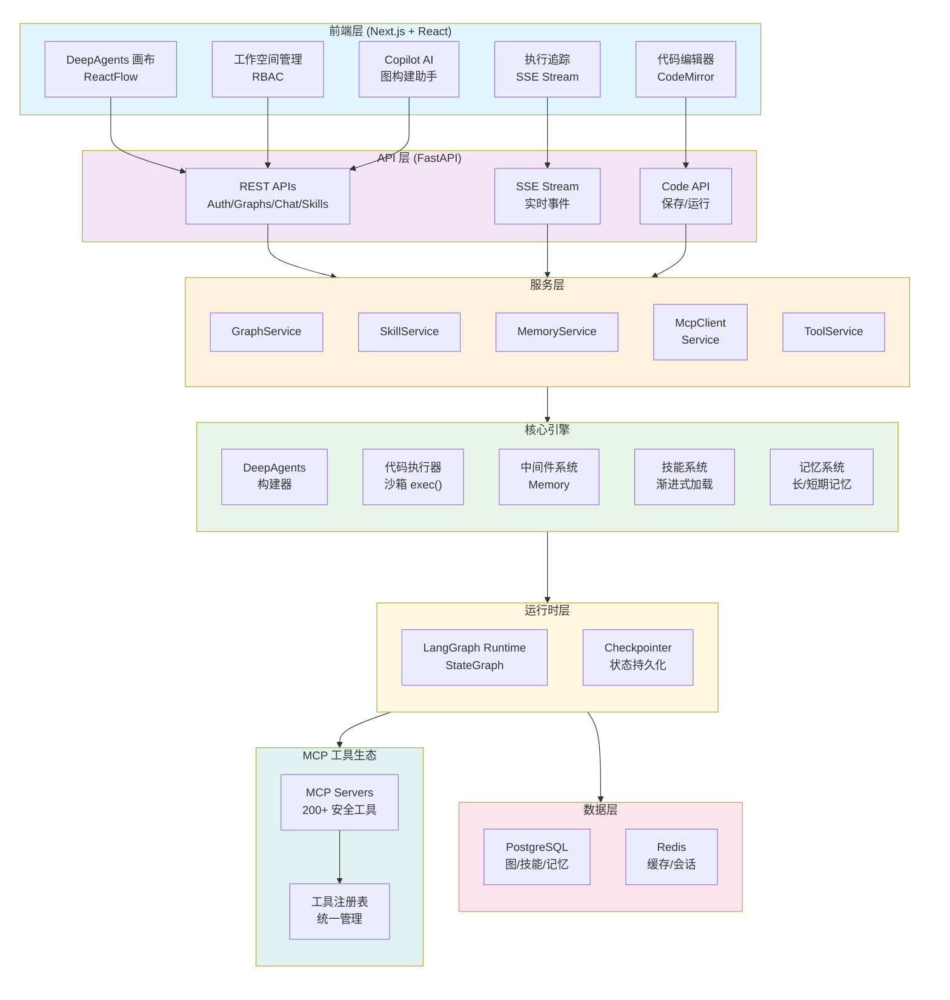
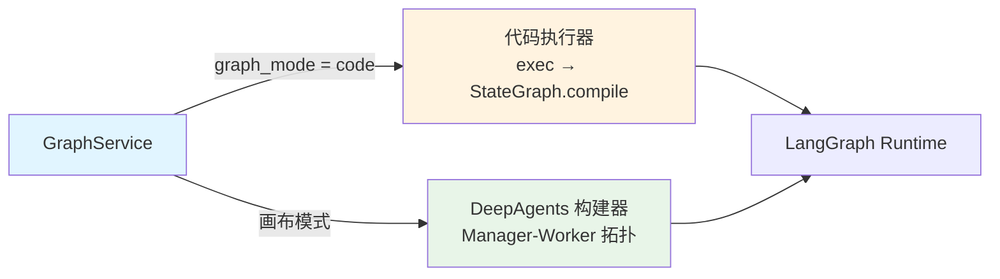
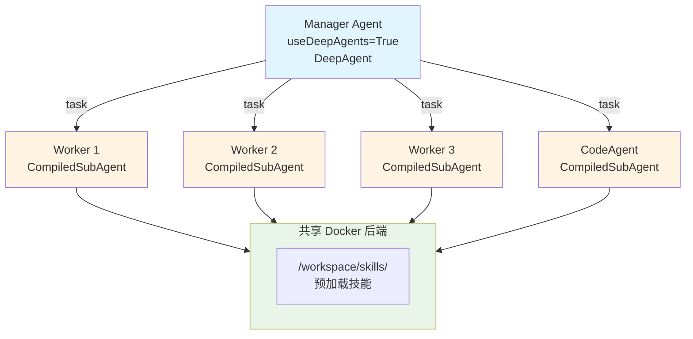
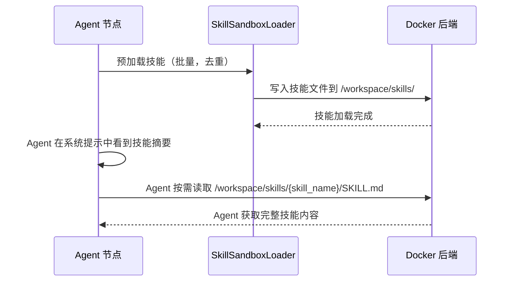
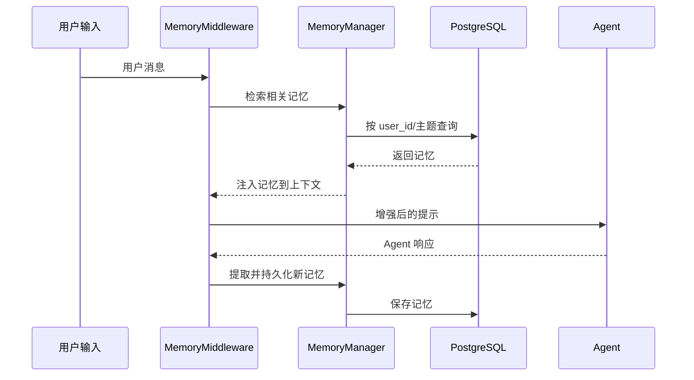

# 架构设计

## 整体架构

JoySafeter 采用分层架构模式，各层职责清晰：



### 核心模块

#### 1. 图构建系统 — 两条路径

系统支持两种图构建模式：



**Code 模式：**
- 用户在浏览器编辑器中编写标准 LangGraph Python 代码
- 后端在沙箱环境中执行代码（受限 builtins、import 白名单、执行超时）
- 从执行结果中提取 `StateGraph` 实例，编译并运行
- 零学习成本 — LangGraph 官方文档就是使用文档

**DeepAgents 画布模式：**
- 可视化拖拽构建多智能体编排
- 三种节点类型：Agent、Code Agent、A2A Agent
- 通过 `deepagents.create_deep_agent()` 构建 Manager-Worker 星型拓扑

#### 2. DeepAgents 多智能体编排

DeepAgents 实现星型拓扑，一个 Manager 协调多个 Worker：



**DeepAgents 构建流水线：**

```
build_deep_agents_graph()
    ├── 1. resolve_all_configs()     — 纯配置提取，无副作用
    ├── 2. 初始化共享后端              — 按需创建 Docker 沙箱
    ├── 3. preload_skills()          — 批量预加载，自动去重
    ├── 4. ModelResolver.resolve()   — 统一 LLM 解析，带缓存
    ├── 5. 构建 Worker               — agent_factory 按节点类型创建
    └── 6. create_deep_agent()       — 编译并最终化
```

**关键设计决策：**
- **无继承** — 使用专用解析器组合（ModelResolver、ToolResolver、SkillsLoader）
- **配置解析是纯函数** — 无副作用，每个节点只解析一次
- **模型解析统一且带缓存** — 节点模型和记忆模型共用同一个解析器
- **星型拓扑**：Manager 直接连接所有 SubAgent（非链式）
- **共享后端**：Docker 后端在所有 Agent 间共享，用于技能和代码执行

#### 3. 代码执行器安全

代码执行器通过多层安全机制运行用户 LangGraph 代码：

| 安全层 | 保护措施 |
|--------|---------|
| **Builtins 黑名单** | 移除 `open`、`eval`、`exec`、`compile`、`globals`、`locals`、`vars`、`dir` |
| **Import 黑名单** | 封锁 `os`、`sys`、`subprocess`、`socket`、`io`、`pathlib` 等 |
| **Import 白名单** | 仅允许 `langgraph`、`langchain`、`typing`、`json`、`pydantic` 等 |
| **执行超时** | exec 10 秒限制（`signal.alarm`） |
| **调用超时** | ainvoke 30 秒限制（`asyncio.wait_for`） |
| **权限检查** | 保存需要 member 角色，运行需要 viewer 角色 |
| **错误脱敏** | 从错误信息中移除服务器文件路径 |

#### 4. 技能系统（渐进式加载）



#### 5. 记忆系统（长/短期记忆）



### 数据流

**前端 ↔ 后端：**
- **REST API**：图配置、技能管理、工具管理、工作空间操作
- **Code API**：保存和运行用户 LangGraph 代码
- **SSE Stream**：实时执行状态、流式输出、节点执行事件

**后端内部：**
- **Code 模式**：`code_executor.execute_code()` → `StateGraph.compile()` → `ainvoke()`
- **画布模式**：`build_deep_agents_graph()` → `create_deep_agent()` → `compile()` → `ainvoke()`
- **LangGraph Runtime → MCP Servers → Tools**：工具调用和执行
- **Middleware → Agent → Model**：请求处理管道

**后端 ↔ 数据层：**
- **PostgreSQL**：图配置、技能、记忆、会话、工作空间
- **Redis**：缓存、限流、会话状态、临时数据

### 后端文件结构（图模块）

```
app/core/graph/
├── __init__.py                    # 导出 build_deep_agents_graph()
├── deep_agents/
│   ├── builder.py                 # 构建编排（无继承）
│   ├── config.py                  # 纯配置提取
│   ├── model_resolver.py          # 统一 LLM 解析，带缓存
│   ├── agent_factory.py           # 创建 agent/code_agent/a2a worker
│   ├── skills_loader.py           # 批量技能预加载，去重
│   ├── tool_resolver.py           # 工具名 → 实例解析
│   └── middleware.py              # Memory 中间件
├── node_secrets.py                # A2A secret 处理
└── runtime_prompt_template.py     # 运行时 prompt 变量替换

app/core/code_executor.py          # Code 模式沙箱执行
```
